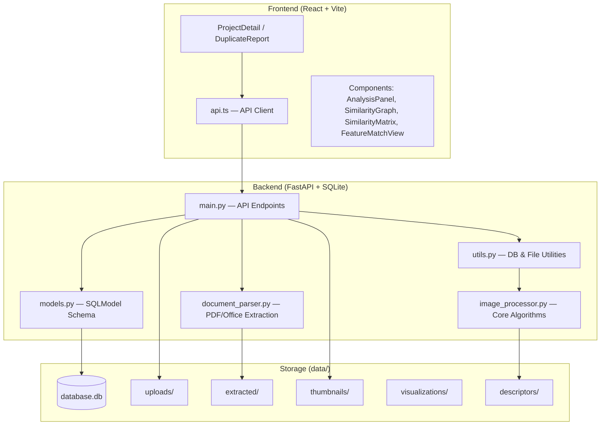
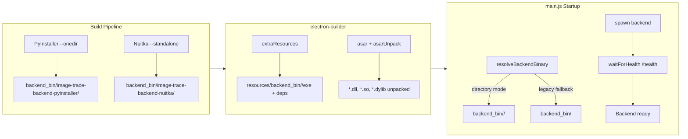

# Image Trace — Architecture

## System Overview

## Backend Modules

### main.py (API Endpoints)
| Endpoint | Method | Description |
|:---|:---|:---|
| `/` | GET | Root info + endpoint list |
| `/health` | GET | Health check |
| `/projects` | POST/GET | Create / list projects |
| `/projects/{id}` | GET/DELETE | Get / delete project |
| `/upload` | POST | Upload image or document |
| `/extract` | POST | Extract images from document |
| `/compare/{project_id}` | POST | Run comparison analysis |
| `/results/{project_id}` | GET | Get comparison results |
| `/analysis_runs/{project_id}` | GET | List analysis run history |
| `/analysis_runs/detail/{run_id}` | GET | Get analysis run detail |
| `/images/{project_id}` | GET | List project images |
| `/images/{image_id}` | DELETE | Delete image |
| `/download` | GET | Download file |
| `/visualize_match` | POST | Generate match visualization image |
| `/pairwise_matrix/{project_id}` | GET | N×N similarity matrix |
| `/thumbnail/{image_id}` | GET | Browser-friendly JPEG thumbnail |
| `/match_data` | POST | Keypoint + match JSON for frontend SVG |
| `/report/{project_id}` | GET | Full duplicate detection report |

### image_processor.py (Algorithm Engine)
| Tier | Algorithms | Functions |
|:---|:---|:---|
| **Hash** | phash, dhash, ahash, whash, colorhash | `compute_image_features`, `calculate_similarity`, `hamming_distance` |
| **Pixel** | SSIM, Histogram, Template | `calculate_ssim_similarity`, `calculate_histogram_similarity`, `calculate_template_similarity` |
| **Descriptor** | ORB, BRISK, SIFT, AKAZE, KAZE | `compute_descriptor`, `calculate_descriptor_similarity`, `draw_feature_matches` |
| **Fusion** | auto (hybrid) | `calculate_hybrid_similarity` |
| **Rotation** | 8-orientation variants | `compare_with_orientations`, `_generate_orientation_variants`, `compute_features_for_variants` |

### utils.py (Infrastructure)
- DB: `get_database_url`, `get_session`, `create_db_and_tables`
- Files: `ensure_directory`, `generate_unique_filename`, `save_upload_file`, `delete_file_if_exists`, `cleanup_project_files`
- Comparison: `compare_images_in_project`, `group_similar_by_metric`

### document_parser.py
- `DocumentParser`: PDF (PyMuPDF), DOCX, PPTX image extraction
- Methods: `extract_images_from_document`, `_extract_from_pdf`, `_extract_from_office`, `_render_pdf_pages`

### models.py (SQLModel Schema)
- `Project`, `Image`, `AnalysisRun`, `SimilarGroup`, `ComparisonResult`
- Read/Create DTOs: `ProjectRead`, `ProjectCreate`, `ImageRead`, `ImageCreate`

## Frontend Components

| Component | Purpose |
|:---|:---|
| `AnalysisPanel.tsx` | 14 algorithms in 4 tiers + rotation toggle |
| `SimilarityGraph.tsx` | Network graph with edge scores + click-to-match |
| `SimilarityMatrix.tsx` | Heatmap N×N matrix |
| `FeatureMatchView.tsx` | SVG keypoint match visualization |
| `DuplicateReport.tsx` | Full report page with print/PDF export |
| `ImageUploadZone.tsx` | Drag-and-drop image upload |
| `DocumentUploadZone.tsx` | Document upload + extraction |

## Desktop Packaging (Electron)

### Binary Resolution Order
1. `backend_bin/image-trace-backend-nuitka/<exe>` (directory mode)
2. `backend_bin/image-trace-backend-pyinstaller/<exe>` (directory mode)
3. `backend_bin/image-trace-backend-nuitka<exe>` (legacy flat)
4. `backend_bin/image-trace-backend-pyinstaller<exe>` (legacy flat)
5. `backend_bin/image-trace-backend<exe>` (legacy name)

### CI/CD
- Trigger: `git push origin v*` tag
- Platforms: macOS (arm64), Windows (x64), Ubuntu (x64)
- Dual-track: PyInstaller + Nuitka per platform
- Artifacts: retention 1 day, Release uploads `.dmg`/`.exe`/`.AppImage`

